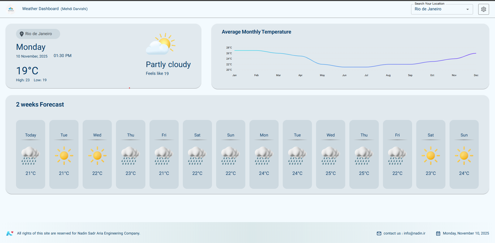
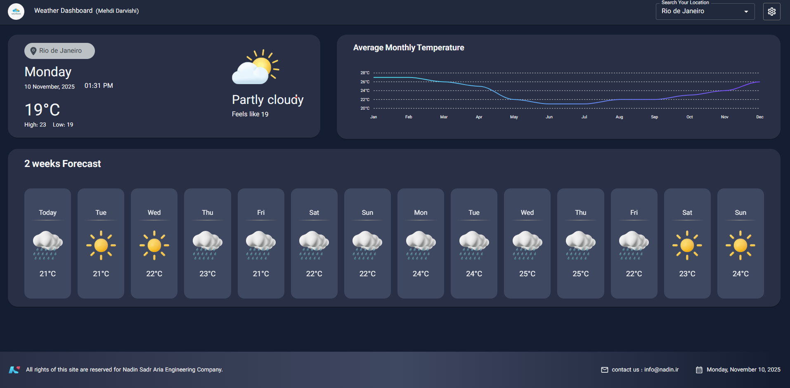
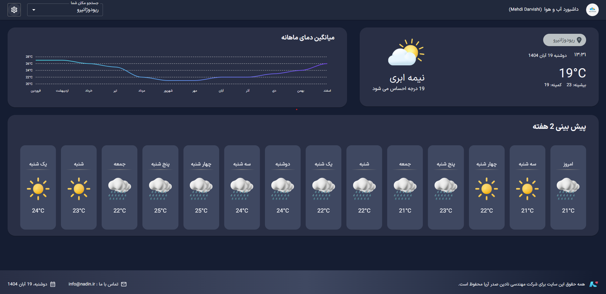

# Weather Dashboard App

A fully responsive, bilingual (Persian/English), dual-theme (Dark/Light) weather dashboard built with React, TypeScript, and MUI. This application features a client-side simulated auth flow, protected routes, and live data from the WeatherAPI.com 14-day forecast API.

## 🚀 Live Demo

**[https://weather-dashboard-t8nu.vercel.app/](https://weather-dashboard-t8nu.vercel.app/)**

*(Note: A valid `VITE_WEATHER_API_KEY` is required. The live demo may not display data if the free tier quota is exceeded. Please clone and run locally for a guaranteed experience.)*

## 📸 Visual Preview

| Light Mode (English) | Dark Mode (English) | Persian Mode (RTL) |
| :---: | :---: | :---: |
|  |  |  |
| *Fully responsive light mode dashboard.* | *Dynamic dark mode support.* | *Complete RTL support for Persian.* |


## 📝 Project Overview

This project is a comprehensive weather dashboard application built as a technical assessment. The primary goal was to create a fully responsive, bilingual application based on the provided UI designs, complete with real-time data from a live weather API, client-side routing, and a simulated authentication flow.

The app demonstrates a clean, scalable, and modern React architecture using Context for state management, `axios` for data fetching, and `MUI` for a robust, theme-aware component library.

## ✨ Key Features

* **🌍 Bilingual Support (i18n):** Full internationalization for English (LTR) and Persian (RTL) using `i18next`. The entire UI, including dates and text descriptions, adapts to the selected language.
* **🎨 Dual-Theme (Dark/Light Mode):** Dynamic theme switching with persistence in `localStorage`, fully integrated with MUI's theming engine and custom palettes.
* **📱 Fully Responsive Design:** Mobile-first, responsive layouts for all components, including a collapsible Navbar (using `Drawer`) for mobile and a full-featured header for desktop.
* **🔑 Simulated Authentication:** A complete, backend-less authentication flow using `localStorage` and React Context to manage and persist user state.
* **🛡️ Protected Routes:** Secure client-side routing with `react-router-dom`, redirecting unauthenticated users from the dashboard to the login page.
* **🌦️ Live Weather Data:** Fetches and displays live 14-day forecast data from the `WeatherAPI.com` API using a centralized `axios` client.
* **📊 Data Visualization:** A dynamic, responsive monthly average temperature chart (using `ApexCharts`) with mock data that updates based on the selected location.
* **🎠 Content Slider:** A responsive, touch-friendly 14-day forecast slider built with `Swiper.js`.
* **🗓️ Jalali (Persian) Calendar:** Correct date and time formatting for both Gregorian (EN) and Jalali (FA) calendars using `day.js` & `dayjs-jalali`.
* **🎨 Custom Icon & Translation Mapping:** Translates API weather codes (e.g., `1003`) into a custom-designed SVG icon set and localized text descriptions via `i18next` JSON files.

## 🛠️ Tech Stack & Libraries

* **Framework:** React 18
* **Language:** TypeScript
* **Build Tool:** Vite
* **UI Library:** MUI (Material-UI) v5
* **Routing:** `react-router-dom` v6
* **State Management:** React Context (for Auth, Language, Location)
* **Data Fetching:** `axios`
* **Internationalization (i18n):** `i18next` & `react-i18next`
* **Charts:** `ApexCharts` & `react-apexcharts`
* **Sliders:** `Swiper.js`
* **Date/Time:** `day.js` & `dayjs-jalali`
* **Deployment:** Vercel

## ⚙️ How to Run Locally

1.  **Clone the repository:**
    ```bash
    git clone https://github.com/mahdi-darvishi/weather-dashboard.git
    cd weather-dashboard
    ```
2.  **Install dependencies:**
    ```bash
    npm install
    ```
3.  **Set up environment variables:**
    Create a `.env` file in the project root and add your WeatherAPI.com API key:
    ```env
    VITE_WEATHER_API_KEY="your_api_key_goes_here"
    ```
4.  **Run the development server:**
    ```bash
    npm run dev
    ```
    The application will be available at `http://localhost:5173`.

## 🏛️ Architectural Decisions

* **Context for Global State:** Used React Context for managing global state (Auth, Theme, Language, Location). This avoids the boilerplate of larger libraries like Redux and is ideal for this app's scale. State is decoupled into separate, logical providers (e.g., `AuthProvider`, `LocationProvider`).
* **Smart Parent / Dumb Component:** Logic is centralized in "smart" parent components (e.g., `DashboardPage`), which fetch and process data. "Dumb" child components (e.g., `CurrentWeatherPanel`, `ForecastDayCard`) only receive props, making them highly reusable, testable, and clean.
* **Centralized API Client:** `axios` is configured with a central `apiClient` instance to manage the `baseURL` and automatically inject the `API key` (`key`) into every request, keeping the data-fetching hooks clean.
* **Theming & Augmentation:** Used MUI's `createTheme` and TypeScript "Module Augmentation" to add custom, theme-aware values (like `gradients.border` and `background.panel`), ensuring 100% type-safety across the application.
* **Data-Driven I18n:** Weather descriptions are not translated manually in the code. Instead, the API weather *code* (e.g., `1003`) is used as a key to look up the correct translation from the `i18next` JSON files (e.g., `"weather.1003": "نیمه ابری"`).

## 👨‍💻 Author

* **Developed by:** Mehdi Darvishi
